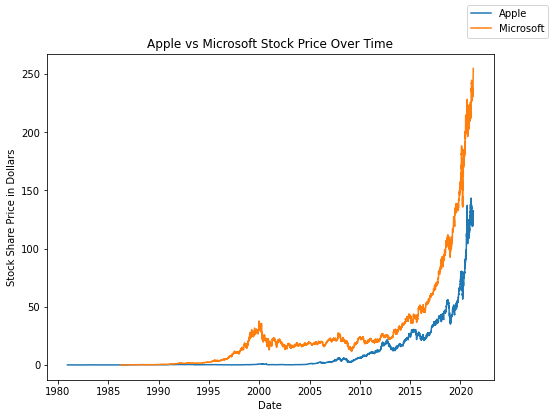
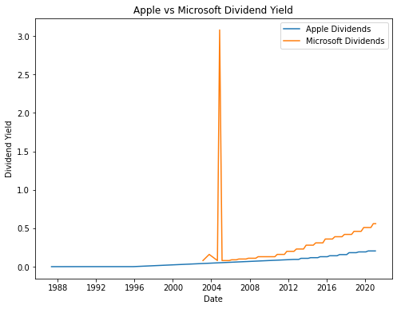
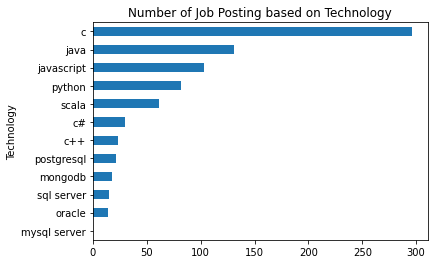
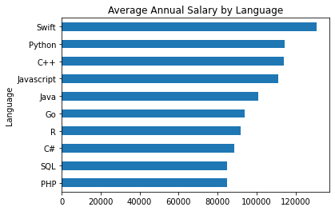

# Michael Dang's Project Portfolio  

## [Developer Survey Dashboard](https://dataplatform.cloud.ibm.com/dashboards/97810601-a667-4018-8c02-138443d90577/view/4e27d53c23916ed641b2bde4079d2f022b62215bb7bb840082d17b490a332297f36c1396c87d19538e43056af7ee160fcc)  

Data was collected from various sources including job postings, training portals, and surveys. The data was converted into a dataframe, cleaned, and then normalized. The data was then imported into IBM Cognos and used to create an interactive dashboard displaying current and future technologies, including programming languages, databases, platforms, and web frames being utilized by IT professionals. Additionally, the demographics of the survey participants were collected and visualized.

## [Stock Comparisons Visualization](https://github.com/mddang3/Project_Portfolio/blob/c3e1bbc48f82d103f01e832dd0264f7443ee8cb7/Stock%20Tracker.ipynb)  

**Code Used**  
Python Version: 3.7  
Packages: yfinance, pandas, matplotlib.pyplot

This program gathers stock data for Apple Inc. and Microsoft Corporation using yfinance stores the data into a dataframe. The data is then visualized with matplotlib.pyplot in order for comparisons to be drawn between the two corporations.    

  

## [GitHub Jobs Analysis](https://github.com/mddang3/Project_Portfolio/blob/c3e1bbc48f82d103f01e832dd0264f7443ee8cb7/GithubJobs.ipynb)

**Code Used**  
Python Version: 3.7  
Packages: requests, pandas 

This program takes over 250 job postings from the GitHub Jobs API, iterates through each job listing searching for keywords, and is stored into a pandas dataframe.  The the number of job postings for each language is calulated, ordered by volume, and visualized to compare job oppourtunities based on various languages.  
  
These languages include:  
*C  
*C#  
*C++  
*Java
*JavaScript  
*Python  
*Scala  
*Oracle  
*SQL Server  
*MySQL Server  
*PostgreSQL  
*MongoDB  

 
## [Average Annual Salary by Language](https://github.com/mddang3/Project_Portfolio/blob/c3e1bbc48f82d103f01e832dd0264f7443ee8cb7/WebScraping.ipynb)  

**Code Used**  
Python Version: 3.7  
Packages: bs4, requests, pandas

This program scrapes salary data based on languages known from a website provided by IBM using BeautifulSoup. The data is then converted to a Pandas dataframe and visualized to compare the average annual salary based on what languages are known.

